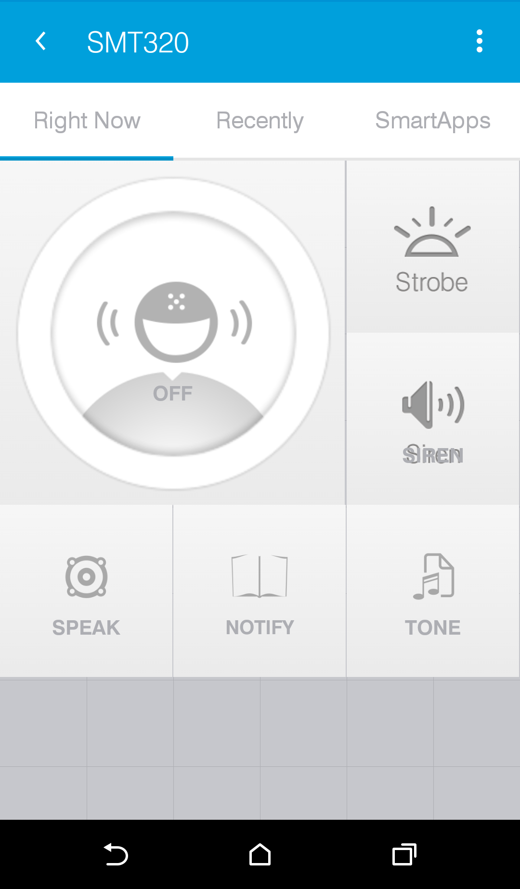
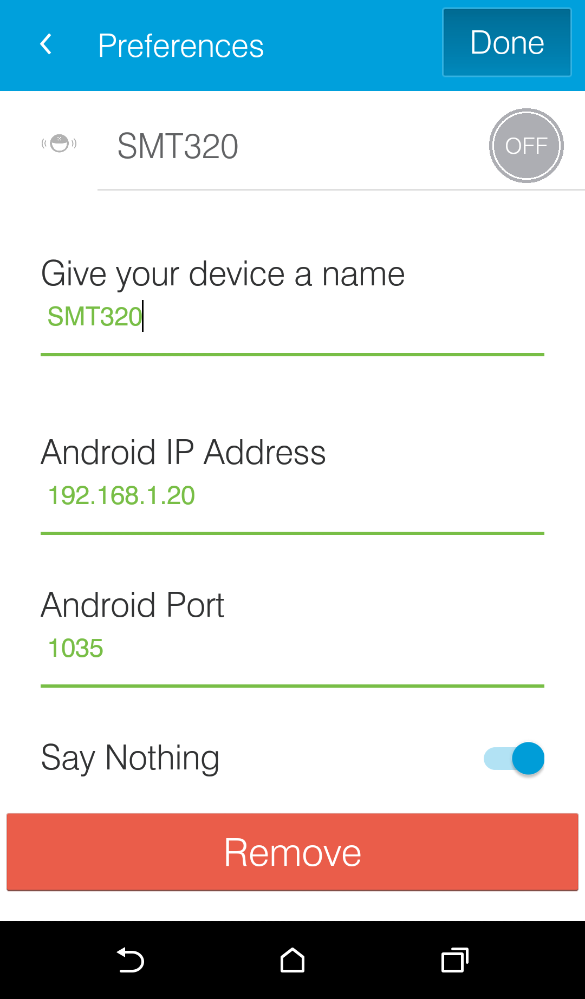
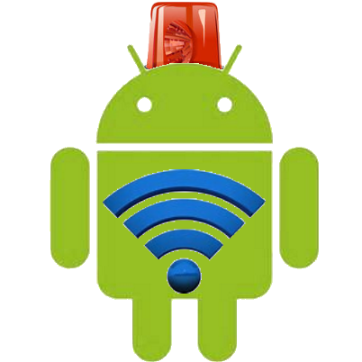
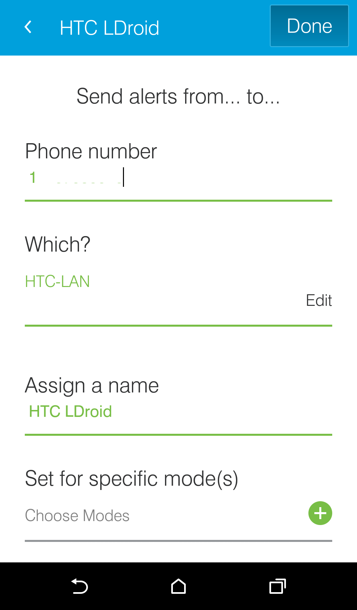
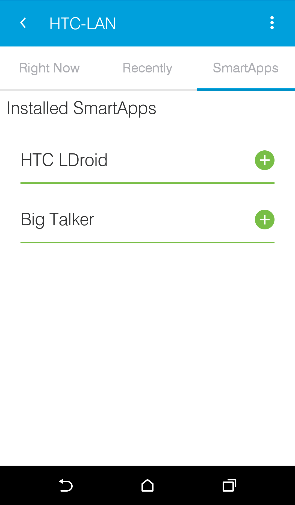

# What is LANnouncer (formerly LANdroid)
LANnouncer is a device driver for the Samsung SmartThings home automation hub, bringing audio alerts to the system through any connected Android device.
LANnouncer supports:
- Speech Synthesis
- Alarms (Siren/Strobe)
- Notification(Tone)

It does so over:
- The LAN (local sub-net; tablet/phone on same WiFi network as the SmartThings hub)
- SMS (anywhere - an SMS is sent to the device, resulting in the functionality but also in otherwise-pointless SMS messages)

This is supported in the SmartThings community thread "Android as a Speech/Alarm Device released!", although this beta thread also may be helpful.

## What's New
Version 2.03.12 brings:
- Audio Files - select files to play
- Audio Stop - Abort a sound
- WAN Support - IFTTT support faster than Google Cloud Notifications
- Better Logging
- Premium User support
The addition of Premium Users is necessary because of the cost not just of working on LANNouncer but of running the necessary server for IFTTT support.  Premium Support doesn't cost much, and gets you:
- Increase from 1 to 5 Audio Files
- Faster GCN Turn-Around - Can send multiple IFTTT or REST-based commands instantly rather than with a one minute delay between.
- Faster WAN Turn-Around - Can send multiple IFTTT or REST-based commands instantly rather than with a several minute delay between.
Note that no features have been removed or disabled with the addition of Premium, and that new features (WAN and Audio Files) have been added even for free users.  Only the quantity/speed is different.

## Index
There are several pages linked from here:
- SmartThings and LANNouncer.  LANNouncer was initially written to solve a SmartThings problem.
- Installing LANnouncer into SmartThings - How to get LANnouncer to work with Samsung's SmartThings platform
- Choosing Communications - How to decide what to enable
- IFTTT Integration - How to use LANnouncer with IFTTT and other REST-based systems
- LANnouncer Commands - Commands you can issue
- Trouble Shooting

## Tips
Example IP Addresses
I.P. addresses here are examples, and will generally be of the form 192.168.1.999 or 192.168.1.xx. You should replace the last segment with the correct I.P. address. 
DONE Marker
When using the SmartThings LANdroid device handler, the DONE marker is appended automatically for you.  But when using other mechanisms, such as SMS from outside of SmartThings or curl commands, you may find reliability improved by tacking it on manually.
The DONE Marker is @DONE@.  It should be appended with a query separator - e.g. 
	curl "192.168.1.999:1035/?ALARM=SIREN&@DONE@"
Speak Envelope
LANnouncer understands socket commands (and SMS commands) that SmartThings natively doesn't know how to send.  And in many cases, SmartThings doesn't have the flexibility to send arbitrary commands; it expects to support only specific devices in specific contexts.  This can be limiting.
To get around this, you can use the SPEAK ENVELOPE.  For example, if an alarm isn't supported but voice is, you could "say" SPEAK=@|ALARM=CHIME to get the chime.
Multiple Commands
When firing several actions against the same LANnouncer at the same time, it's better to issue them as one with a SPEAK Envelope than as individual commands.  This is because SmartThings does not handle sockets well, so the best approach is to send few of them.
Commands can be strung together with &.  This can be done via the Speak Envelope or directly if using sockets.  
For example, to send a chime and collect a sequence of photos, you can send the commands ?CHIME=ALARM&RETRIEVESEQ=MYCAMERA.  
This even works with speech; you could send, e.g., 
curl "192.168.1.999:1035/?SPEAK=@|ALARM=CHIME&SPEAK=Hello daddy&@DONE@"
Testing
Use curl.  Heavily.  To test image retrieval, ensure the command should return images (rather than just saving them), and redirect the curl results to a file.

## Installing It
Read through this page to understand what pieces are what, and then start with the next section, Getting It, to get all the code
The Installation Instructions can walk you through all the configuration. 

## Getting It
LANnouncer comes in three parts:
- The SmartThings device handler - download this groovy file and follow directions below to install.
- The SmartThings SmartApp to enable SMS devices - download this groovy file and follow directions below to install.
- The LANnouncer Android application/filter/service - go to the Google Play Store here to install.
If the Play Store won't let you download, it's probably due to region or your Android version. You may download from this link, but it may be less current and may not work due to your device software version.

## Taking Advantage Of LANnouncer
LANNouncer supports quite a few commands, many of which take parameters. These can be sent via text-to-speech tools in Home Automation systems, via REST calls, SMS messages, even curl scripts.
This section overviews the commands. 

### Additional Commands
- @#ALARM=CHIME
- Sound a chime, like a store entry
  (Same as using the Notification.beep device capability.)
- @#ALARM=DOORBELL
- Sound a doorbell
- @#ALARM=ALARM
- Sound an alarm, like a missile warning
- @#ALARM=FILE1
  Plays the first of the configured audio files. Premium users have up to FILE5. Of course it must be correctly configured on the device you are sending the command to.
- @#ALARM=STOP
- Abort the ALARM sound (chime, siren, a file playing) immediately. 
- @#ALARM=SIREN
  Sound an old-style police siren
  (Same as using the Alarm.Siren device capability.)
- @#VERSION=ON
  Speak the version
- @#FLASH=STROBE
  Strobes the flash for about 10 seconds
  (Same as using the Alarm.Strobe capability.)
- @#FLASH=LONG
  Turns the flash on for about 10 seconds
- @#PHOTO=BACK
  Takes a photo from the device back camera.
  (FRONT is an unimplemented option currently.)
- @#PHOTO=BACK&STSHRINK=TRUE
  You wouldn't use this from BigTalker, but this will return the image in a SmartThings-friendly size.
    e.g. curl "192.168.1.xx:1035/?PHOTO=BACK&STSHRINK=TRUE&@DONE@" > test3.jpg
    would retrieve a small copy to test3.jpg
- @#PHOTO=BACK&WAIT=TRUE
  Same as above, but for a full-sized photo
- @#RETRIEVE=camera_name&WAIT=TRUE
  RETRIEVE grabs an image from the configured camera (see Installation.)  The WAIT and STSHRINK commands will cause it to be returned; otherwise it merely is copied to the Android device media folder and, if configured, to the Dropbox folder.
- @#VIDEO=seconds_to_record
  Takes video with the Android camera, putting it in the media folder and optionally to Dropbox.
- @#RETRIEVESEQ=camera_name
  Retrieves a sequence of photos from the remote camera.  This is set for 4 photos, at 3+ seconds apart, though is generally constrained by the camera login speed.

### SPECIAL COMMANDS
- SPEAK=@|
  This is the SPEAK ENVELOPE, that allows arbitrary strings (commands) to be sent via text-to-speech.

### Sending Commands
The LANnouncer service is not limited to contacts from the SmartThings hub. Commands can be sent directly via, e.g. curl: 
    curl "192.168.1.xx:1035/?ALARM=SIREN&@DONE@" 
    curl "192.168.1.xx:1035/?VERSION=ON&@DONE@" 
If you have enabled GCM or WAN functionality, you can use the remote server also as in the IFTTT section. The syntax is a bit difference, as you must be authenticated.  So a similar command might look like:

    curl "http://lannouncer.keybounce.com:1036/command?userName=mySecretIdentity@gmail.com&deviceName=Google%20Nexus%209&command=ALARM%3DCHIME"

The SPEAK extensions can also be sent via curl, however be aware that in some environments, curl cannot send "#", so "|" is used for LANdroid instead, as in...
    curl "192.168.1.20:1035/?SPEAK=@|ALARM=CHIME&@DONE@"

## SmartThings and LANNouncer
As used with Samsung's SmartThings Home Automation kit, there are multiple parts to LANnouncer:

### LANnouncer Device
A standard Groovy SmartThings device driver, the LANnouncer device is required functionality on the SmartThings hub to get messaging working to the devices.
It can be configured with the LAN IP address of the desired device. (If it's an SMS device, leave this blank and add the Remote LANdroid SmartApp to connect to SMS.) Multiple LANnouncers can be configured, allowing a phone to receive different messages (e.g. only alarms) than a local tablet (e.g. door chimes.)
After starting, LANnouncer runs in the background; the tablet or phone can be used as normal.

### The Device Screen
After you've created a device, this screen appears.  It is only for testing; you won't normally need this screen.
From this device, these tiles control the target device.  (I.e. in this case, the SMT320 tablet.)
The Strobe tile turns on the flash briefly.  The Siren turns on an Alarm sound.  Speak will, if the settings (next screen) allow 'Say Nothing', tell you that LANnouncer is working.  Notify does the same thing with a Toast.  And Tone plays a chime.

The menu allows editing settings; in this case they are:

The "Device Name" will be how you refer to this device from SmartApps, including Remote LANdroid.  

The "Android IP Address" may be empty, if this "LANnouncer Device" will be communicating via SMS using Remote LANdroid.  You will have one LANnouncer device per target device.  (Unless you happen to want the exact same messages sent to both a LAN and an SMS target.)

Important: The IP Address should be static or your device may change IP address.  You can typically set this by:
- Settings
- Wi-Fi (Touch and hold the name of the Wi-Fi connection to modify, until a pop-up menu appears)
- Modify Network
- Scroll to the bottom of the menu
- Check "Advanced Options"; this will cause more options to appear.  Scroll down to the newly-exposed options.
- Under "IP SETTINGS", if "DHCP" is listed, touch it and change it to "Static"
- Enter the desired IP Address.

Note that if you have a sufficiently advanced router, you can assign a static IP to the device based on the MAC address from the router.
You can find your Android's IP Address under [Settings] [Wi-Fi], typically the menu button, and then [Advanced Settings]; it's usually near the bottom.

### Note On Updating
If you update the device code (version), you may have to force SmartThings to recognize the new version. Just FYI. 

## LANnouncer Service
 The LANnouncer Service (formerly LANdroid / TTSService, but Google didn't like the embedded "android") is the Android application/service that runs on the phone or tablet. It specifically watches for network or SMS messages coming from LANroid, and acts on them. This differs from some other contemporary SmartThings speech devices in that the speech synthesis is done on the Android device, rather than merely being played on it.
The LANnouncer Service can be set to listen on the network (on the port of your choice; 1035 is the default), or to watch for SMS messages, or both.
There are some configuration options on LANnouncer, but they're largely unimplemented currently (Alpha stage.)  All you really need to know is:
You must start LANnouncer for it to run and work
If you are in LAN mode (which you probably should be), you should press "Start Network Services" once
You can then switch away from LANnouncer , and it will continue running in the background
LANdroid should be downloaded from the Google Play Store to get the latest version.  

### LANnouncer Android Requirements
LANnouncer requires SDK 21, which means Lollipop, Android 5.0, or above.  This isn't capricious; because I've updated all of my devices and because I initially wasn't even considering publishing this (it was just to solve an annoyance), I used Android methods supported by my devices. Specifically, the AudioAttributes.Builder class, added in SDK 21.

## Remote LANnouncer
Remote LANnouncer is a SmartThings SmartApp that watches for LANnouncer events and forwards them to the desired Android phone via SMS. These will be a bit cryptic, of the form ALARM=ALARM&@DONE@, and consequently you will not only receive the speech, alarm or strobe, but also an SMS - with the audio notification if enabled and with the slightly-cluttered inbox.
Due to a foible in how Android contexts and receivers interact, Remote LANnouncer's U.I. will pop-up in SMS mode when playing Text-To-Speech.  It should go back into the background quickly.  Do not press "back" if this happens; you can press Home or "Recently Used", but not Back, or you will terminate the service.

The phone number is the entire number to send the SMS to.  
The "Which" refers to which LANDroid Device.  It is possible that non-LANdroid devices will be listed; select only a LANdroid device.
The name selected may be used by applications, and will appear as the SmartApp in the Device listing, as below:

As mentioned at the top, the Remote LANdroid functionality uses SMS.  This does mean you will also receive SMS notifications (e.g. a "bing" if that's what your phone does when you get an SMS), and additional messages in your SMS inbox.  I added the incoming address to my address book with the name "SmartThings Hub", so I could recognize and ignore them.

### Taking Advantage Of LANnouncer
The basic aspects of LANnouncer can be configured using standard SmartThings functionality. The Alarms, for example, work just as expected. But SmartThings as shipped is a bit light on functionality.

### Add BigTalker
In addition, you will probably want to add Ray Zurbock's Big Talker or a similar SmartApp, to make configuring speech easy. This then can connect speech to most events. (Not, unfortunately, alarm modes, but beyond that, most events.)

### Additional Commands
The standard SmartThings commands are a bit light on flexibility. For example, there's no distinction between a chime, a doorbell and an alarm. But LANnouncer supports these.
To get there, use Big Talker or another speech driver to send the command strings.

## About
LANdroid and LANnouncer were written by NWTony/KeyBounce in response to his frustration at the lack of audio outputs from SmartThings.
